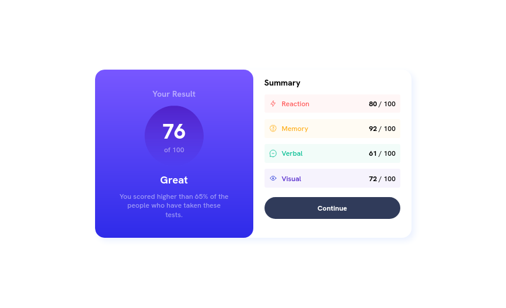
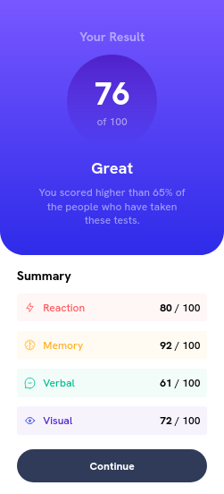

# Results Preview Card

- [Results Preview Card](#results-preview-card)
  - [About](#about)
  - [Preview](#preview)
    - [Desktop](#desktop)
    - [Mobile](#mobile)
  - [Process](#process)
    - [Languages](#languages)
    - [Technologies](#technologies)
    - [Tools](#tools)
  - [Links](#links)

A [Frontend Mentor](https://www.frontendmentor.io) project.

## About

Been playing around this one three or four times. But, I never got a clue of how to make it look almost the same as on the preview images provided.

**FINALLY**, I got it almost close to the preview. Now I can take rest!

## Preview

### Desktop

### Mobile

## Process

### Languages

- HTML
- CSS

### Technologies

- CSS Grid
- CSS Flex

### Tools

- Visual Studio Code
- Mozilla Firefox(116.2)
- Live Server

## Links

- GitHub Repository: [Code-Beaker/results-preview-card](https://github.com/Code-Beaker/results-preview-card)
- GitHub Pages: [code-beaker/results-preview-card](https://code-beaker.github.io/results-preview-card/)
- Netlify: [results-preview-card](https://results-preview-card.netlify.app/)
